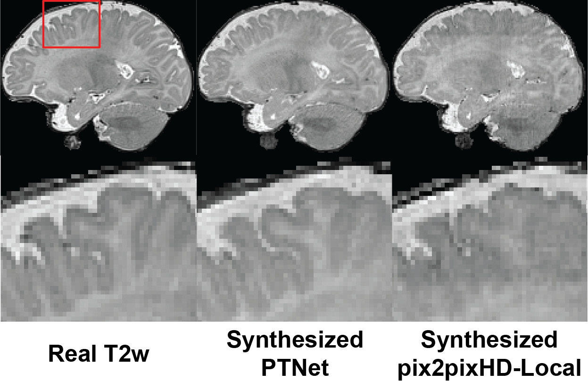

# PTNet3D
Public code for 3D version of Pyramid Transformer Network (PTNet). Our PTNet achieve consistently better performance in high-resolution and longitudinal infant brain MRI synthesis than previous SOTA methods. 

Example on synthesizing 3-month-old infant T2w conditioned on T1w:

Complete codes, documentations, and demos will be publicly available upon paper's acceptance. Check the previuos 2D version: https://github.com/XuzheZ/PTNet
